# Musium
A Flutter app to listen music.
[New features will be added in the future]

## Features
* Welcome screen
* Splash screen
* Registration
* Authorization
* Auto account authorization
* Data from the Firebase
* Song categories
* Search songs
* Favorite songs
* Play/stop music

## Packages
* flutter_svg: [link](https://pub.dev/packages/flutter_svg)
* provider: [link](https://pub.dev/packages/provider)
* audioplayers: [link](https://pub.dev/packages/audioplayers)
* http: [link](https://pub.dev/packages/http)
* flutter_dotenv: [link](https://pub.dev/packages/flutter_dotenv)
* shared_preferences: [link](https://pub.dev/packages/shared_preferences)

### Screenshots
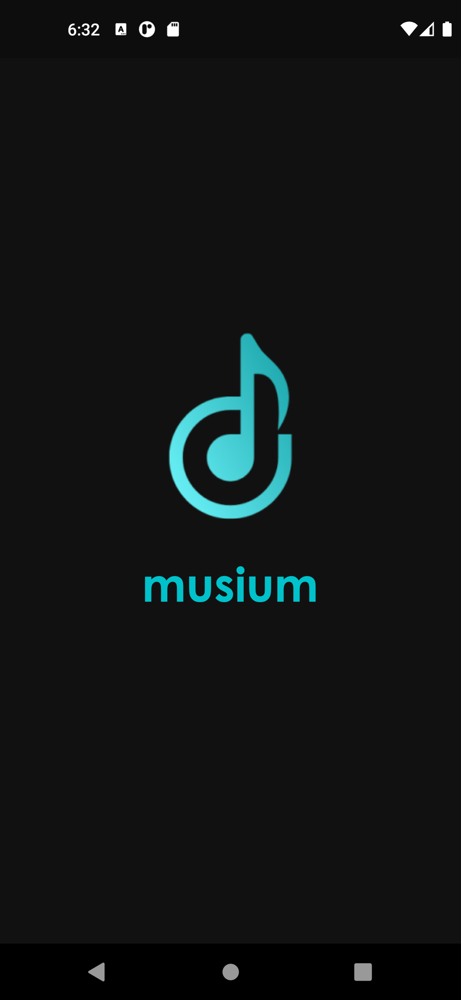</img>
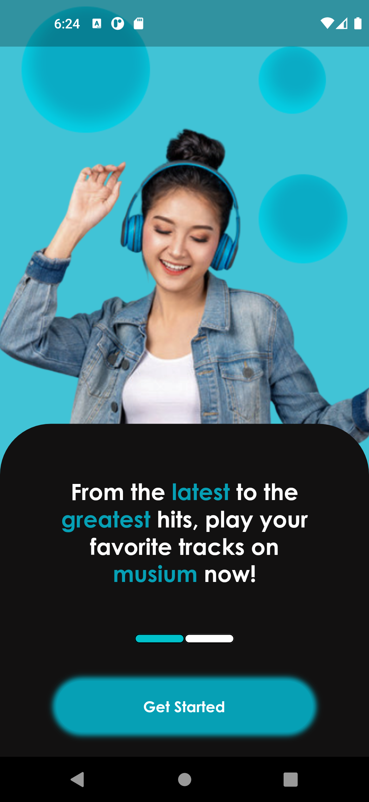</img>
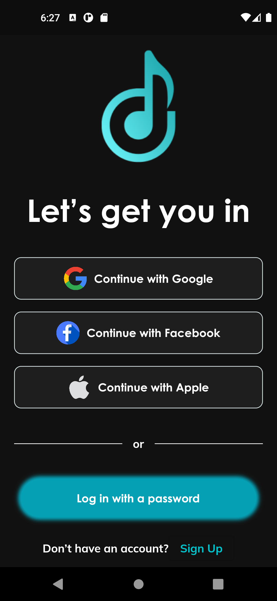</img>
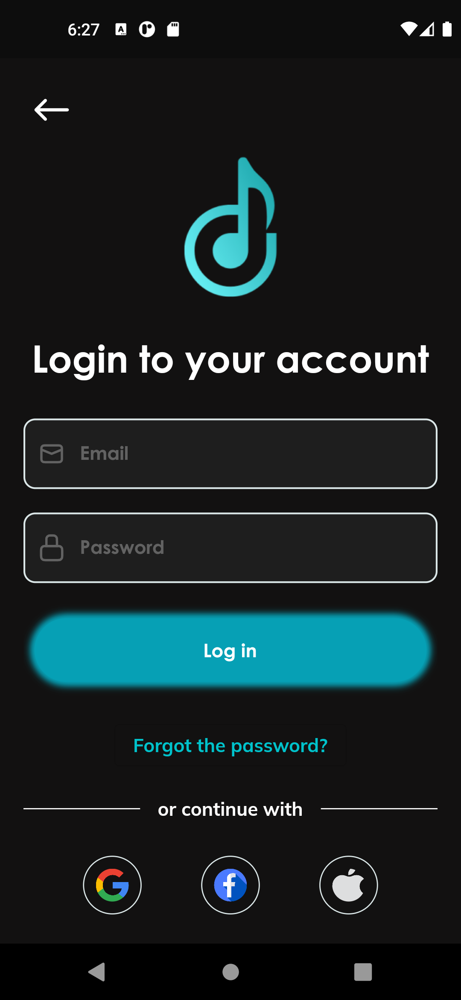</img>
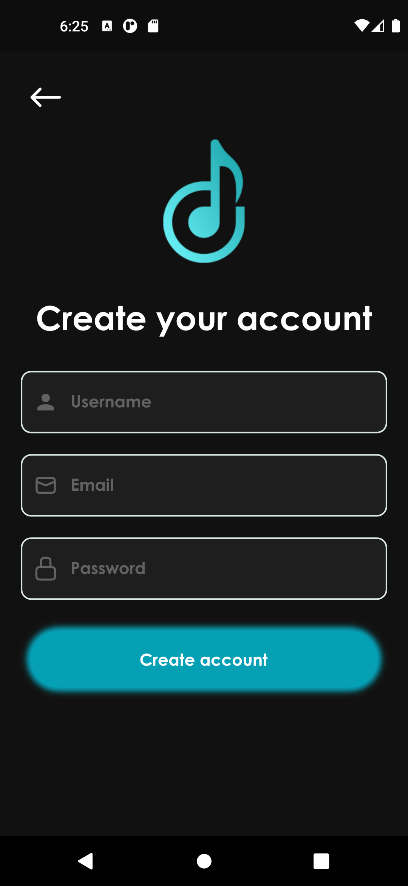</img>
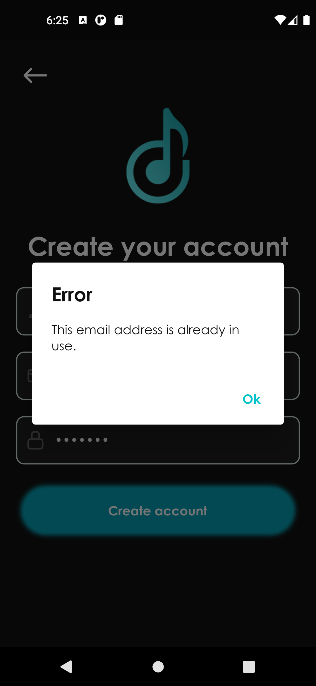</img>
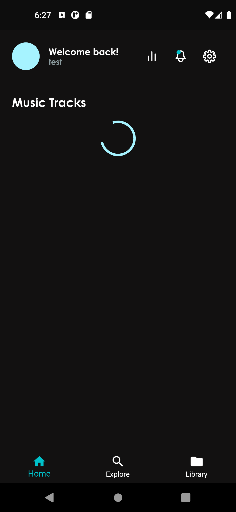</img>
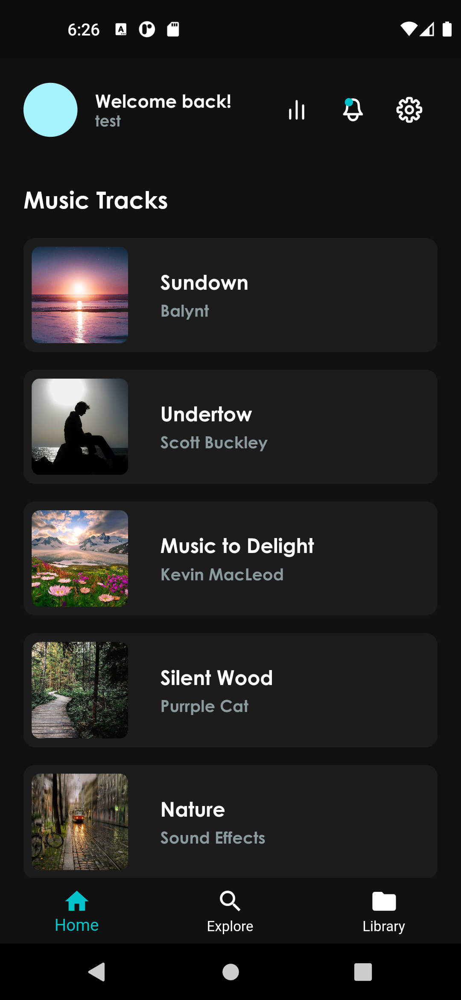</img>
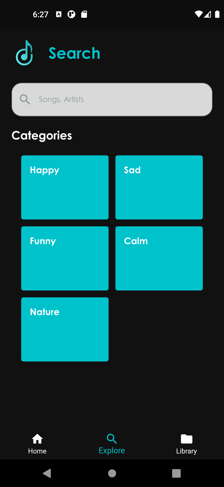</img>
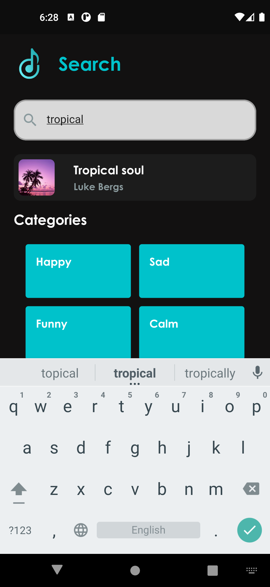</img>
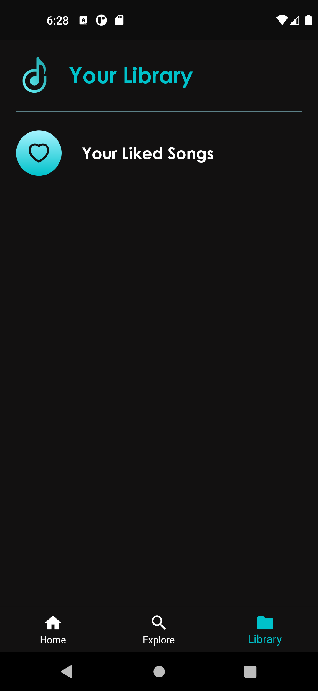</img>
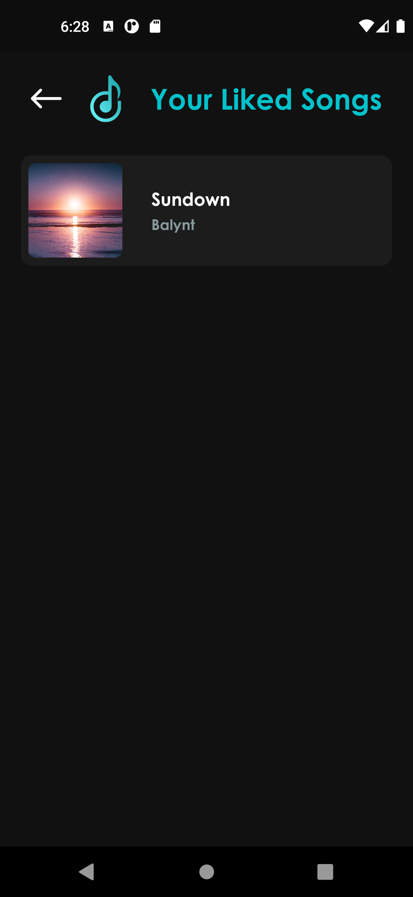</img>
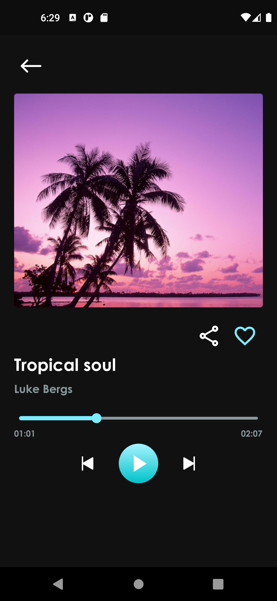</img>
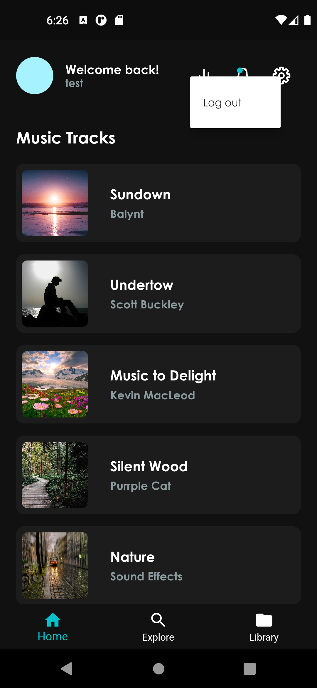</img>